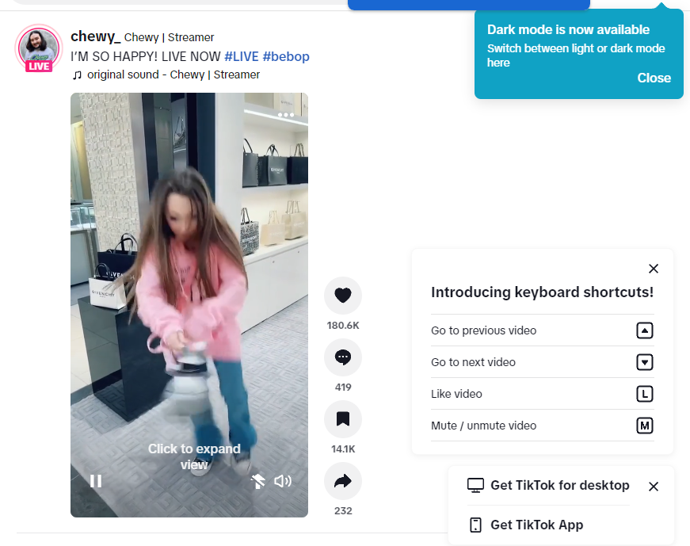

# tiktok_scrape
CS315 project testing how likes affect a user's recommendation algorithm using Selenium.

##### The TikTok audit code is in the PageTiktok.py file in the page_objects folder.

## How to Run the Code
### 1. Clone the Repository
You should be able to clone the repository by running
```
git clone https://github.com/mjdgv/tiktok_scrape
```
or by cloning manually on GitHub Desktop.

Tip: Clone the repository in a folder that is easy to access. You can also create a new directory by running the code below in your terminal. The mkdir command creates a folder—in this case our example folder is named scraper, but you can change the name to whatever you'd like. The cd command makes our current directory the folder we just created.
- If you choose to go this route
```
mkdir scraper
cd scraper
```

### 2. Open VS Code
2. Activate conda's base environment (should show ```(base)``` before your directory in your terminal).


### 3. cd to Repository
Next, change your working directory to the repository you cloned. This is different from opening the folder in VS Code, though you can change directories through the terminal in VS Code. You can change your working directory using the cd command. 
```
cd tiktok_scrape
```

### 4. Create a virtual environment
Next you will want to create a virtual environment. This can be done through Python's own venv library, or using the [easily installable virtualenv library](https://techinscribed.com/python-virtual-environment-in-vscode/). The next steps will cover installation through Python's built-in library.
    
**a.** Open a terminal, either zsh on Mac or PowerShell on Windows. You may need to **run the terminal as administrator/root user** if this is your first time creating a virtual environment. 

**b.** Run the command 
    
    python -m venv .venv

This will create a directory called `.venv` (you can change the name if you like). This directory is useful because it contains its own python version and package manager. This means that when activated, the python version you use is located in .venv rather than your global python version. Furthermore, any packages installed while the venv is activated will only be accessible in the virtual environment. This is especially helpful with version conflicts, but shouldn't be an issue if you're a newer Python user or don't have other projects in Python.

**c.** Activate the virtual environment. This command varies between platforms. On Windows, it is
        
    .venv/Scripts/activate

and on Mac/Linux the command should be

    source .venv/bin/activate

Here is a list of ways to activate if your shell is different than the default:


**d.** To turn off the virtual environment once you are done, it should suffice to type `deactivate` into your terminal.


### 5. Install Required Packages
Next you'll need Selenium and other important packages. Luckily, having the virtual environment standardizes the command! Run

    pip install -r requirements.txt
   
### 6. Run the Code
Now you should be able to run the code. The source code is located in `page_objects/PageTiktok.py` and the test that you will run is located in `tests/tiktok/test_tiktok.py`. Customize these to your heart's content! All raw data exports will be stored in CSVs under `data/`. To run the tests, you can run

    python -m pytest . --html=report.html

This will run tests we specified in `tests/` and should export data from an instance where the algorithm

a. Doesn't interact with videos at all. 

b. Watches videos if they're part of a pre-decided list of hashtags.

Any output from the tests, as well as any information about failures, will be located in a file generated called `report.html`, located in the home directory of the repository. This is what the `--html=report.html` flag indicates when we run pytest.

**Some common bugs during this step include:**
- #### _main-py: error: unrecognized arguments: --html=report.html
  Try running

         pip install pytest-html

- If you get an error message such as this: 

  Try running

         pip install module (in this case numpy)


### 7. When the Code Runs...
When the code starts running, it will bring up a pop up window where Tiktok is open. It is important that you manually log in to the Tiktok page and solve the Captcha puzzle built to deter automated bots like us. After you manually log in and solve the puzzle, get rid of the keyboard shortcut and tiktok for desktop/app pop-ups, and the algorithm should perform as intended! You have about 40 seconds to perform this login and clear all the pop-ups, if you take any longer this will probably cause the first test to fail, the second one should still work though.




### 8. Troubleshooting

#### Running Scripts is Disabled on this System

If you're on Windows, you may have an issue with the execution policies allowed for scripts on the machine. To bypass this, we used this command in an administrator terminal:

    Set-ExecutionPolicy RemoteSigned -Scope CurrentUser

If the issue persists, talk to Miles.

On Mac/Linux, you may have to run `sudo source .venv/bin/activate`, though it shouldn't be a problem.

#### Chrome Not Installed
**a.** In terminal, run 

    sbase get chromedriver


## Things to Notice:
1. You can commment/uncomment the output csv code two iterate_through functions.
2. If the requirements does not work, pip install packages mentioned in the import
3. pytest contains both tendency liking/random liking test codes
4. You will have to **manually input** your account. Afterwards you can hold on to it and wait until the page start moving. If the terminal shows that it is still running, do not touch your tiktok webpage until your pytest pass/fail(feel free to look at other stuff while waiting)
5. report.html has to be opened in the browser to see the cleaned version

Currently, the code successfully identifies posts with **predefined hashtags** (scenario 1), and scrolls to the next batch if it's done with the current batch. 


## Have to work on:
- IP addresses for the locations. 

